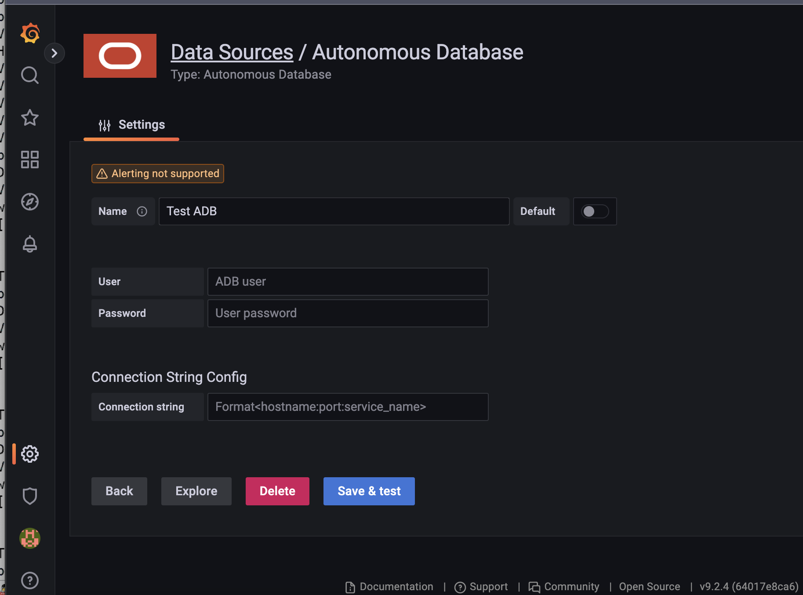
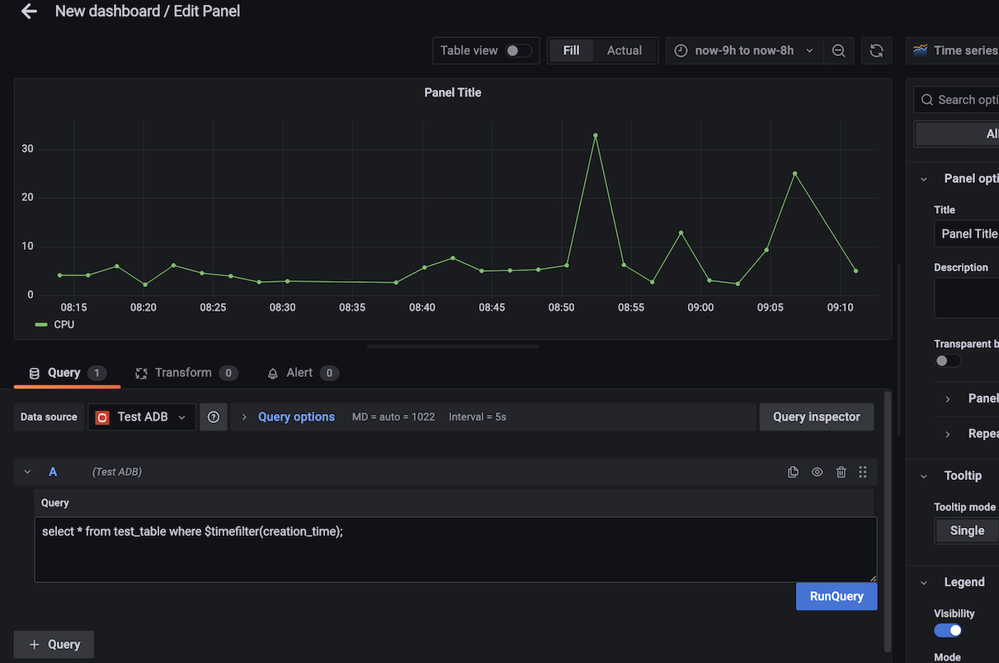
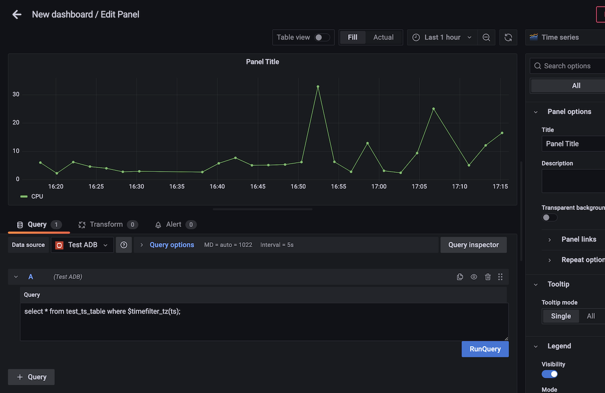
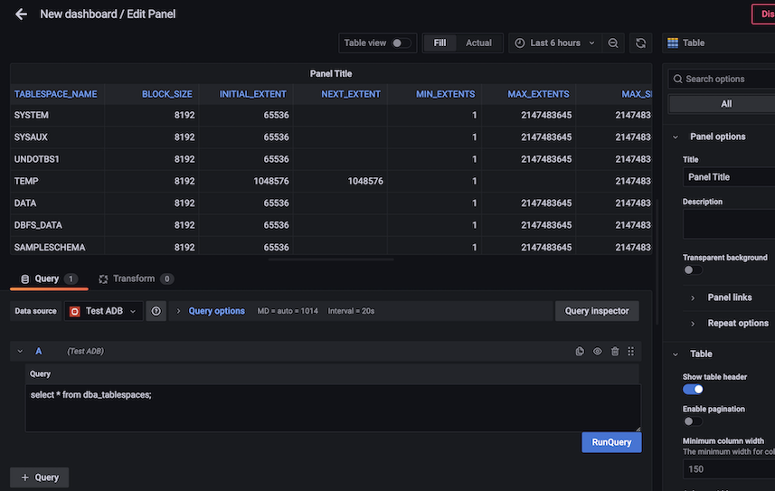

# About Autonomous Database plugin for Grafana

## Introduction
The plugin connects to Oracle Autonomous Database and make queries to it and display them on Grafana.

It is a datasource backend plugin which requires username, password and basic connection string to connect to Oracle ADB.

It can query for timeseries and Non-timeseries data. 

The Plugin is compatible with grafana version >=9.1.2.

## Installation
First Download/Clone the plugin complete code as it also contains binaries in dist and let's say the path of downloaded plugin folder is $plug_path. 

### In Docker
Use Docker to load the plugin with grafana server in it with this command.

    docker run -d -p 3000:3000 -v $plug_path:/var/lib/grafana/plugins -e "GF_PLUGINS_ALLOW_LOADING_UNSIGNED_PLUGINS=oracle-adb-datasource" --name=<container_name> grafana/grafana:9.2.4

Restart the container with 

    docker restart <container-name>

### Install manually on mac or linux
Add the plugin folder from $plug_path to grafana plugin folder (/usr/local/var/lib/grafana/plugins) and set allow_loading_unsigned_plugins = oracle-adb-datasource in config file of it (mainly in default.ini) and restart the grafana server after that. 

### Install from grafana community
The steps for this will be added once it is approved.

## How to Use

* Go to Datasources in setting in grafana page and add datasource. Scroll down and select `Autonomous Database`. 

* In the config page, add `username` and `password` of the user of ADB and add Connection String in `hostname:port:servicename` format.

* Change the name of Datasource to your choice. 

* Click on `Save&Test` to test connectivity to the ADB with the configuration you added. It prompts `Datasoure is working` message if the connection is reachable.

*   

* On Query Page Add the configured Datasource. 

* Provide pl/sql query in the `Query` box for the ADB connected to get the data out of it after clicking `RunQuery` button . 

* For timeseries data you can use `$timefilter(timecolumname)` for  timestamp or date type data to query the data for a period of timespan selected in grafana-page.

*   

*  You can add multiple queries in the same panel.

* You can use `$timefilter_tz(timecolumnname)` for timestamp with time zone datatype for same purpose. 

*   

* You can query for `non-timeseries` data too to show it on table.

*   

* Save the Panel to your Dashboard. 

## Code link
https://github.com/oracle-samples/adbs-tools/tree/adb-plugin/adb-grafana-plugin (will update with main branch after merging)

## Future works
* PACKAGING OF PLUGIN
* Looking for ways to upload wallet to the server and wallet should be mapped to server user for connection with wallet case, so that we can add wallet connection too.
* Can move to another go driver later on to get more flexibility in connection strings and get connection pool options too.
* Implement additional features like Alerting.
* Implement SQL macros to provide user  to avoid writing complex queries with proper syntax.: Implemented ($timefilter macro to map grafana selected time to select data in query)

## Development of the plugin

   * Need following latest packages:
      * go       :  https://golang.org/
      * npx      :  https://www.npmjs.com/package/npx
      * yarn     :  https://classic.yarnpkg.com/en/docs/install
      * mage     :  https://magefile.org/
      * docker   :  https://docs.docker.com/engine/install/

   * Please refer to https://grafana.com/tutorials/build-a-data-source-backend-plugin/ for the commands.

## References
* [Grafana Backend datasource plugin development ](https://grafana.com/tutorials/build-a-data-source-backend-plugin/)
* [Go-ora driver](https://github.com/sijms/go-ora)
